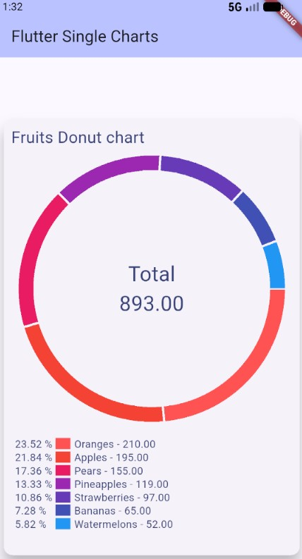

<!--
This README describes the package. If you publish this package to pub.dev,
this README's contents appear on the landing page for your package.

For information about how to write a good package README, see the guide for
[writing package pages](https://dart.dev/tools/pub/writing-package-pages).

For general information about developing packages, see the Dart guide for
[creating packages](https://dart.dev/guides/libraries/create-packages)
and the Flutter guide for
[developing packages and plugins](https://flutter.dev/to/develop-packages).
-->
# flutter_simple_charts

A very simple donut and bar chart package, lightweight and easy to use

## Features

The flutter_simple_charts offers two types of charts: donut and bar charts.

- **Donut chart** - Very simple donut chart, lightweight and easy to use;

- **Bar chart** - Very simple bar chart, lightweight and easy to use;

### Screenshots

<div align="center">

 |  |  | 
:---:|:---:|:---:|:---:

</div>

## Getting started

## Installation

Add to your `pubspec.yaml`:

```yaml
dependencies:
  flutter_simple_charts: latest
```

## Quick Start

### Basic Usage

```dart
import 'package:flutter/material.dart';
import 'package:flutter_simple_charts/flutter_simple_charts.dart';

void main() {
  runApp(const MyApp());
}

List<DataItem> itens = [
  DataItem(id: 0, label: 'Oranges', value: 210),
  DataItem(id: 1, label: 'Apples', value: 195),
  DataItem(id: 2, label: 'Bananas', value: 65),
  DataItem(id: 3, label: 'Pears', value: 155),
  DataItem(id: 4, label: 'Strawberries', value: 97),
  DataItem(id: 5, label: 'Watermelons', value: 52),
  DataItem(id: 6, label: 'Pineapples', value: 119),
];

class MyApp extends StatelessWidget {
  const MyApp({super.key});

  @override
  Widget build(BuildContext context) {
    return MaterialApp(
      title: 'Charts Demo',
      theme: ThemeData(colorScheme: .fromSeed(seedColor: Colors.indigo)),
      home: MainPage(),
    );
  }
}

class MainPage extends StatelessWidget {
  const MainPage({super.key});

  @override
  Widget build(BuildContext context) {
    return Scaffold(
      appBar: AppBar(
        backgroundColor: Theme.of(context).colorScheme.inversePrimary,
        title: Text('Flutter Single Charts'),
      ),
      body: Center(
        child: SingleChildScrollView(
          child: Column(
            children: [
              DonutChart(
                title: 'Fruits Donut chart',
                dataset: itens,
                showLabels: false,
                showLegend: true,
                datasetOrdering: DatasetOrdering.decrescent,
                onSectorTap: (sectorValue) => _showDialog(
                  'Item: ${sectorValue.label} - Quantity: ${sectorValue.value}',
                  context,
                ),
              ),
              BarChart(
                title: 'Fruits Bar chart',
                dataset: itens,
                showLabels: true,
                showLegend: true,
                datasetOrdering: DatasetOrdering.decrescent,
                onBarTap: (barValue) => _showDialog(
                  'Item: ${barValue.label} - Quantity: ${barValue.value}',
                  context,
                ),
              ),
            ],
          ),
        ),
      ),
    );
  }
}

void _showDialog(String message, BuildContext context) {
  showDialog<void>(
    context: context,
    builder: (BuildContext context) {
      return AlertDialog(
        title: const Text('Flutter Single Chart'),
        content: Text(message),
        actions: <Widget>[
          TextButton(
            style: TextButton.styleFrom(
              textStyle: Theme.of(context).textTheme.labelLarge,
            ),
            child: const Text('Close'),
            onPressed: () {
              Navigator.of(context).pop();
            },
          ),
        ],
      );
    },
  );
}
```
